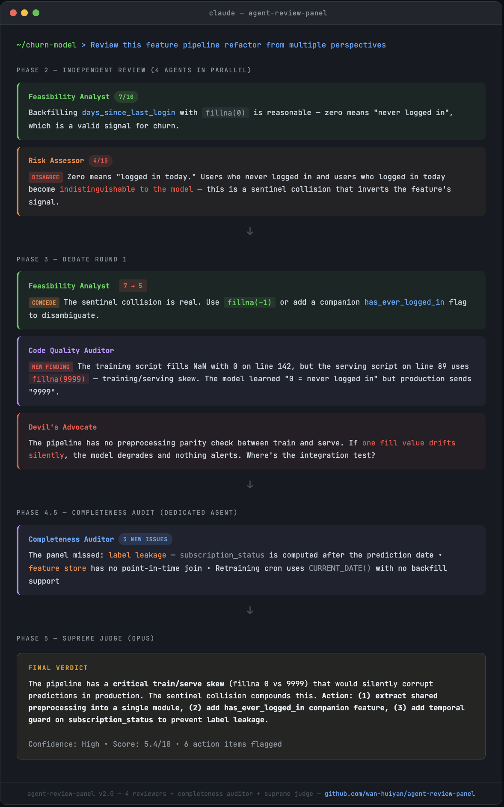

# Agent Review Panel

A Claude Code skill that orchestrates multi-agent adversarial review panels. Multiple AI reviewers with distinct personas independently evaluate your work, debate each other's findings, then a supreme judge renders the final verdict — all compiled into a structured report for human review.


*Example: 4-6 reviewers independently review an ML pipeline, debate each other's findings, then a completeness auditor and supreme judge weigh in.*

## Why This Exists

**The single-reviewer problem:** When you ask Claude to "review this code" or "check this plan," you get one perspective. It's thorough, but it's one mind looking at one thing. It won't argue with itself. It won't catch its own blind spots. And it will never tell you "I'm not sure about this" the way a real team would.

**What research shows:** Papers from ICLR 2024 (ChatEval), ICML 2024 (Du et al.), and ACL 2024 (MachineSoM) demonstrate that multi-agent debate consistently outperforms single-agent review on evaluation quality — agents cross-verify each other's claims, challenge weak reasoning, and surface issues no individual reviewer would find alone.

**What you get that a single reviewer can't provide:**

| Feature | What It Does |
|---|---|
| Structured disagreements with reasoning | Each disagreement shows both sides' arguments + the judge's ruling |
| Numerical scores + verdict | Every reviewer scores independently; judge delivers final recommendation |
| Cross-reviewer debate & engagement | Reviewers respond to each other's specific points across 1-3 rounds |
| Anti-groupthink blind assessment | Final scores given without seeing others' finals — prevents conformity |
| Post-debate completeness audit | Dedicated agent re-reads source line-by-line after debate to catch what everyone missed |
| Claim verification (Phase 4.6) | Verifies all reviewer line-number citations against actual source — catches hallucinated findings |
| Epistemic labels on findings | Every finding tagged [VERIFIED], [CONSENSUS], [SINGLE-SOURCE], [UNVERIFIED], or [DISPUTED] |
| Scope & limitations disclosure | Every report states what the panel cannot evaluate — prevents over-trust |
| Correlated-bias warning | When all reviewers agree (spread < 2pts), flags that unanimity may reflect shared model bias |
| Code-level detail catching | Line-by-line audit of constants, sets, SQL, config values in every review |
| Auto-persona from content signals | Keyword detection adds domain specialists (ML, SQL, Security, etc.) up to 6 reviewers |
| Source-grounded debate | Disputed points include inline source code snippets — keeps debate anchored to reality |
| Context gathering (Phase 1) | Auto-scans sibling directories for docs, traces imports/references, discovers safety mechanisms, asks user about gaps |
| Absent-safeguard check (judge) | Judge verifies [CRITICAL] recommendations account for existing safety mechanisms before endorsing |
| Reviewer suggestion qualifier | Reviewers must state what safeguard would need to be absent; flag unverified assumptions |
| Diverse reasoning strategies | Each reviewer uses a different reasoning approach (systematic enumeration, adversarial simulation, backward reasoning, etc.) |
| Anti-rhetoric guard | Judge flags position changes driven by eloquence rather than evidence |
| Dynamic sycophancy intervention | Detects and intervenes when >50% of position changes lack new evidence |
| Judge confidence gating | Low-confidence verdicts get "HUMAN REVIEW RECOMMENDED" flag instead of forcing a call |
| Tiered knowledge mining (Phase 1) | L0/L1/L2 loading: scans index lines first, then summaries, then full content only for relevant items — reduces token waste by ~80% vs flat reads |
| Built-in domain checklists | 9 signal groups get pre-built review checklists (ML, SQL, Pipeline, Cost, etc.) — zero-latency domain expertise |
| Deep research mode | Opt-in web research for domain best practices; triggered by "deep review" or offered when strong signals detected |

The skill doesn't just find *more* issues — it **structures** them. You get consensus points, disagreement points with both sides' reasoning, a judge's ruling, and prioritized action items. A single reviewer gives you a list; the panel gives you a deliberation.

## How It Works

```
Phase 1    Context & Setup     Scan sibling dirs, trace references, discover safeguards, select personas
Phase 2    Independent Review  4-6 reviewers evaluate in parallel (no cross-talk)
Phase 2.5  Private Reflection  Each reviewer re-reads and rates own confidence
Phase 3    Debate (1-3 rounds) Reviewers engage with each other + find new issues
Phase 3.5  Summarize           Distill resolved/unresolved points between rounds
Phase 4    Blind Final         Each reviewer gives final score independently
Phase 4.5  Completeness Audit  Dedicated agent scans for what the panel missed
Phase 4.6  Claim Verification  Verify all line-number citations against source
Phase 5    Supreme Judge       Opus arbitrates everything including audit findings
Phase 6    Document            Structured markdown report for human review
```

## What Makes This Different from "Just Asking Claude to Review"

### 1. Real Debate, Not Simulated Perspectives

When you ask a single agent to "review from multiple perspectives," it produces parallel sections — but they never disagree. There's no cross-verification, no "wait, that's wrong because..." moments.

The review panel spawns independent subagents that genuinely engage:

> **Feasibility Analyst:** "The `data_available_through` hardcoding is minor — it's documented."
>
> **Risk Assessor:** "Disagree. If stale, the lookforward extends past actual data → model trains on rows with incomplete outcomes → silent false-negative bias."
>
> **Feasibility Analyst (Round 2):** "Valid point. I upgrade this to IMPORTANT."

This isn't possible with a single agent.

### 2. The Discovery vs. Argumentation Problem (and How We Solve It)

v1 of this skill had a subtle failure mode: debate rounds shifted agents from *finding issues* to *responding to each other*. A single-pass reviewer sometimes caught code-level details that the debating panel missed entirely.

v2 fixes this with:
- **Completeness Auditor** — a post-debate agent whose sole job is to re-read the source line-by-line and find what everyone missed
- **"New Discovery" requirement** — each debate round requires agents to find at least one issue no one has mentioned yet
- **Hybrid persona selection** — for mixed content (plans with code), always includes a Code Quality Auditor alongside strategic personas

v2.1 goes further:
- **Auto-persona from content signals** — keyword-based detection automatically adds domain-specific reviewers (e.g., Statistical Rigor Reviewer for ML code, Data Quality Auditor for SQL) up to 6 total
- **Source-grounded debate** — Phase 3.5 summaries include inline code snippets for disputed points, keeping debate anchored to the actual source rather than drifting into abstraction

v2.2 adds context awareness, reasoning diversity, and debate quality safeguards:
- **Context gathering** (Phase 1) — auto-scans sibling directories for docs, traces imports/references, discovers existing safety mechanisms, and confirms gaps with the user before review begins. This addresses the "correct symptom, wrong prescription" problem where reviewers flag real issues but recommend fixes that conflict with existing safeguards they didn't know about.
- **Reviewer suggestion qualifier** — reviewers must state what safeguard would need to be absent for their recommendation to apply, and flag unverified assumptions
- **Absent-safeguard check** — the judge verifies [CRITICAL] recommendations account for existing safety mechanisms before endorsing them
- **Diverse reasoning strategies** (DMAD) — each persona uses a different reasoning approach (systematic enumeration, backward reasoning, adversarial simulation, etc.) so reviewers think differently, not just look at different things
- **Anti-rhetoric guard** — the judge explicitly checks whether position changes were driven by evidence or eloquence

v2.3 adds knowledge intelligence and domain expertise:
- **Knowledge mining** — before launching reviewers, mines feedback memories (past corrections), project/global lessons, and related skill insights. These are the highest-value context sources — hard-won lessons from prior mistakes.
- **Built-in domain checklists** — 8 signal groups (ML, SQL, Pipeline, Cost, Auth, Infra, API, Frontend) get pre-built review checklists injected into matching personas. Zero-latency domain expertise without web search.
- **Deep research mode** — opt-in web research for domain best practices. Say "deep review", use `/agent-review-panel deep`, or the skill offers it when strong signals (5+ keywords) are detected.
- **2 new signal groups** — Cost/Billing (Cost Auditor) and Data Pipeline/ETL (Pipeline Safety Reviewer), bringing total to 8.

v2.4 adds portability detection:
- **Skill/Docs Portability signal group** — auto-detects when reviewing skills or documentation that claim cross-platform applicability. Adds Portability Auditor persona with 7-item checklist: verify "universal" claims against official docs, flag dialect-specific SQL, check cross-references exist, detect project-specific patterns. 9 signal groups total.
- Motivated by real case: reviewing a dbt skill where 3 Databricks-specific patterns were labeled "universal conventions."

v2.5 adds a trust & verification layer (from applying the [AI Trust Evaluation Framework](https://github.com/wan-huiyan/ai-trust-evaluation) to the panel itself):
- **Phase 4.6: Claim Verification** — a dedicated agent verifies every reviewer line-number citation against the actual source material. Classifies each as [VERIFIED], [INACCURATE], [MISATTRIBUTED], [HALLUCINATED], or [UNVERIFIABLE]. Catches hallucinated findings before the judge sees them.
- **Epistemic labels** — the judge classifies every finding as [VERIFIED], [CONSENSUS], [SINGLE-SOURCE], [UNVERIFIED], or [DISPUTED]. Users instantly know which findings to act on vs. investigate.
- **Scope & Limitations section** — every report explicitly states what the panel cannot evaluate (runtime behavior, production data, shared model biases). Prevents over-trust.
- **Correlated-bias disclaimer** — when all reviewers converge (score spread < 2 points), the report warns that unanimity may reflect shared model biases rather than genuine quality. Key insight: the most dangerous failure mode for a multi-agent panel is unanimous agreement on something wrong.
- See `ROADMAP.md` for future items including model diversity, synthetic benchmarks, and calibration footnotes (merged from former TRUST_ROADMAP.md).

v2.6 restructures for efficiency and composability (schliff score 75 → 86):
- **References directory** — domain checklists, prompt templates, and changelog extracted to `references/` files. SKILL.md reduced from 1,331 → 340 lines (75% token reduction) while preserving all review methodology.
- **Explicit negative scope** — "When NOT to Use" section prevents false triggers on single code reviews, bug fixes, deployment tasks, and skill improvement requests.
- **Structured domain checklists** — specialist reviewers (Data Quality, Pipeline Safety) now use explicit checklist format from `references/signals-and-checklists.md`, producing systematic assessments.
- **Validated via A/B test** — v2.5 and v2.6 ran the same review on a 1,132-line ML pipeline plan. Both reached identical verdict (4/10, "Needs Significant Revision") with the same core findings. v2.6 showed marginal improvements in checklist discipline (+2 findings) and judge output structure (P0/P1/P2 tiers). See `docs/archive/v25-vs-v26-comparison.md` for full comparison.

v2.7 adds severity verification and temporal scope checks:
- **Phase 4.7: Severity Verification** — new Opus agent reads actual code for every P0/P1 finding before the judge. Produces severity verification table. Motivated by benchmark showing 2/3 P0 findings were overstated.
- **`[EXISTING_DEFECT]` vs `[PLAN_RISK]` labels** — P0 requires `[EXISTING_DEFECT]` (with code evidence). `[PLAN_RISK]` caps at P1.
- **Temporal scope verification (Step 3b)** — mandatory check that temporal exclusion claims apply to ALL instances across the full date range. Born from a real engagement where "excludes Christmas" only excluded the first of two Christmases, evading 12 reviewers across 3 debate rounds.

v2.8 adds 4 new mechanisms + tiered knowledge mining:
- **Severity-dampening judge prompt** — "What is the minimum severity justified by concrete evidence?" (prompt edit, zero latency)
- **Coverage check** — new judge sub-step asking "Are there unexamined risk categories?" Counterbalances the downward pressure of severity-reduction mechanisms. Surfaced by the review panel itself — the Risk Assessor identified that all proposed changes suppressed findings with no upward pressure.
- **Phase 4.55: Verify-before-claim (advisory mode)** — agents include verification commands; orchestrator runs grep/read and annotates `[CMD_CONFIRMED]`/`[CMD_CONTRADICTED]`. Failed verification demotes, does not delete.
- **Auto-detected Precise/Exhaustive mode** — code reviews require concrete evidence; plan reviews allow broader risk. Auto-detected from content type.
- **Tiered knowledge mining (L0/L1/L2)** — inspired by [OpenViking](https://github.com/volcengine/OpenViking)'s context layers. L0 scans index lines/descriptions (~100 tokens each), L1 reads summaries of matched items (~500 tokens), L2 loads full content only for confirmed-relevant items. Typical yield: 3-8 files at L2 out of 50+ candidates at L0.
- **Lost constraint restoration** — panel self-review of the v2.6 schliff pass caught 15+ prescriptive constraints lost during optimization. Judge prompt restored from skeleton (~20 lines) to full behavioral detail (~80 lines) including anti-rhetoric nuance, absent-safeguard procedures, epistemic label definitions, and verdict confidence calibration.
- See `references/research-v28.md` for the 19-source research backing and `docs/archive/review_panel_report.md` for the full panel deliberation.

v2.9 adds VoltAgent specialist agent integration:
- **VoltAgent integration** — when [VoltAgent specialist agents](https://github.com/VoltAgent/awesome-claude-code-subagents) are installed, the panel upgrades generic persona-prompted reviewers to domain-specific agents (127+ available across 10 families). A `voltagent-qa-sec:code-reviewer` has deeper built-in code review heuristics than a generic agent prompted as "Correctness Hawk."
- **3-tier mapping** — core personas (16), signal-detected specialists (35 content signals), and orchestration phases (completeness audit, verification) all map to VoltAgent agents with graceful fallback.
- **Smart installation prompts** — when VoltAgent agents would help but aren't installed, suggests the relevant `claude install-skill` commands (only once per session, non-blocking).
- **Devil's Advocate stays generic** — the contrarian role intentionally avoids domain specialization to maintain unbiased skepticism.
- Born from real production use: a 4-VoltAgent-specialist panel (QA Expert, Data Scientist, DevOps Engineer, Code Reviewer) reviewing a test plan produced 38 findings with <10% cross-reviewer overlap — each specialist caught blind spots the others missed.

### 3. Anti-Groupthink Mechanisms

Research shows multi-agent systems are prone to conformity — agents abandon correct findings under social pressure. We counter this with:

- **Private reflection** before debate (MachineSoM) — agents commit to confidence levels before seeing others' views
- **Blind final assessment** (ChatEval) — final scores given without seeing others' finals
- **Calibrated agreement intensity** (DebateLLM) — each persona has a tuned skepticism level (20-60%), preventing both reflexive agreement and manufactured disagreement
- **Conformity tracking** — the judge flags any agent that flipped position without new evidence
- **Dynamic sycophancy intervention** (CONSENSAGENT) — when >50% of position changes lack new evidence, an alert is injected requiring agents to identify a weakness in the consensus
- **Judge confidence gating** (Trust or Escalate) — low-confidence verdicts flag "HUMAN REVIEW RECOMMENDED" rather than forcing a definitive call

### 4. Structured Output for Humans

The output isn't a wall of text. It's a scannable report:

```markdown
## Executive Summary          ← Read this in 30 seconds
## Scope & Limitations        ← What the panel can't evaluate (new in v2.5)
## Score Summary Table        ← Initial → Final scores per reviewer
## Consensus Points           ← What everyone agreed on
## Disagreement Points        ← Each side's argument + judge's ruling
## Completeness Audit         ← What the whole panel missed
## Claim Verification         ← Which reviewer citations checked out (new in v2.5)
## Action Items               ← [CRITICAL] [VERIFIED] / [IMPORTANT] [CONSENSUS] / etc.
## Full Transcript            ← Collapsible details for deep dives
```

## Usage

```
> Review this implementation plan from multiple perspectives: docs/my_plan.md

> /agent-review-panel

> Get a panel review of the authentication module — I want to stress-test the design

> Red team this deployment strategy

> Have agents debate whether this refactor is worth the complexity

> /agent-review-panel deep              ← deep research mode (adds web research)

> Do a deep review of this ML pipeline   ← also triggers deep research mode
```

The skill auto-detects content type (pure code, pure plan, mixed, documentation) and selects appropriate personas. It scans for technology signals (SQL, ML/Statistics, Infrastructure, Auth, API, Frontend, Cost/Billing, Data Pipeline) and automatically adds domain-specific reviewers when 3+ keywords from a signal group are detected. You can also specify custom reviewers.

## Research Foundations

| Source | Contribution |
|--------|-------------|
| [ChatEval](https://github.com/thunlp/ChatEval) (ICLR 2024) | Blind final judgment, anti-groupthink |
| [AutoGen](https://github.com/microsoft/autogen) Multi-Agent Debate | Solver/aggregator architecture |
| [Du et al.](https://arxiv.org/abs/2305.14325) (ICML 2024) | Cross-verification for factuality |
| [MachineSoM](https://github.com/zjunlp/MachineSoM) (ACL 2024) | Private reflection, conformity tracking |
| [DebateLLM](https://github.com/instadeepai/DebateLLM) | Agreement intensity modulation |
| [DMAD](https://github.com/MraDonkey/DMAD) (ICLR 2025) | Diverse reasoning strategies per persona |
| [Talk Isn't Always Cheap](https://arxiv.org/abs/2509.05396) (ICML 2025) | Anti-rhetoric guard in judge prompt |
| [CONSENSAGENT](https://aclanthology.org/2025.findings-acl.1141/) (ACL 2025) | Dynamic sycophancy intervention |
| [Trust or Escalate](https://arxiv.org/abs/2407.18370) (ICLR 2025) | Judge confidence gating |
| [AI Trust Evaluation Framework](https://github.com/wan-huiyan/ai-trust-evaluation) | Claim verification, epistemic labels, scope disclosure, correlated-bias detection |
| [VoltAgent/awesome-claude-code-subagents](https://github.com/VoltAgent/awesome-claude-code-subagents) | 127+ specialist agents across 10 families; persona-to-agent mapping for domain-specific reviews |

See `ROADMAP.md` for the full research roadmap (includes trust & verification items, merged from former TRUST_ROADMAP.md).

## Cost & Performance

- **Duration:** ~6-8 minutes per review (vs ~3 minutes for single-agent). 6-reviewer panels (with auto-persona) run ~8 minutes.
- **Tokens:** Comparable to single-agent (~75k vs ~80k) — focused personas are more token-efficient. Auto-added reviewers add ~25-30% when triggered.
- **When to use:** High-stakes reviews where you need structured disagreement tracking, not quick feedback
- **When NOT to use:** Simple code reviews, style checks, or when you just need a quick sanity check

## Installation

### Claude Code

**Option 1: Plugin install (recommended)**
```bash
/plugin marketplace add wan-huiyan/agent-review-panel
/plugin install agent-review-panel@wan-huiyan-agent-review-panel
```

**Option 2: Git clone**
```bash
git clone https://github.com/wan-huiyan/agent-review-panel.git ~/.claude/skills/agent-review-panel
```

### Cursor

Cursor supports skills via `~/.cursor/skills/` (Cursor 2.4+), though global discovery can be flaky. Options from most to least reliable:

**Option 1: Per-project rule (most reliable)**
```bash
mkdir -p .cursor/rules
# Create .cursor/rules/agent-review-panel.mdc with the content of SKILL.md
# Add frontmatter: alwaysApply: true
```

**Option 2: npx skills CLI**
```bash
npx skills add wan-huiyan/agent-review-panel --global
```

**Option 3: Manual global install**
```bash
git clone https://github.com/wan-huiyan/agent-review-panel.git ~/.cursor/skills/agent-review-panel
```

> **Cursor adaptation note:** This skill was written for Claude Code’s **Agent tool** (6+ subagent calls with parallel spawn, model selection, etc.). Cursor has its own subagent/task mechanism (e.g. `mcp_task`), but the full panel flow isn’t guaranteed without adaptation — differences in parallel spawning, prompt shape, and model selection (e.g. `model: "opus"`) may affect behavior.
>
> **Adapting for Cursor:** The core pattern is straightforward — one subagent/task per reviewer in Phase 2, collect results, then one per reviewer in Phase 3 (debate), then single agents for the completeness audit and judge. If you adapt it, PRs are welcome!

## Companion Skills

| Skill | What It Does | When to Use |
|-------|-------------|-------------|
| [plan-review-integrator](https://github.com/wan-huiyan/plan-review-integrator) | Takes review panel output and integrates findings into an implementation plan — classifies each finding, applies concrete edits, produces a traceability summary | After a panel review of a plan document, run `/plan-review-integrator` to turn findings into plan updates |

---

The skill triggers automatically when you ask for multi-perspective reviews, panel reviews, adversarial reviews, or invoke `/agent-review-panel`.

## Acknowledgements

Trigger accuracy and eval suite improved using [schliff](https://github.com/Zandereins/schliff) — an autonomous skill scoring and improvement framework. Schliff's 7-dimension structural scorer identified weak trigger coverage and guided targeted description enrichment (composite score: 64 → 75).
